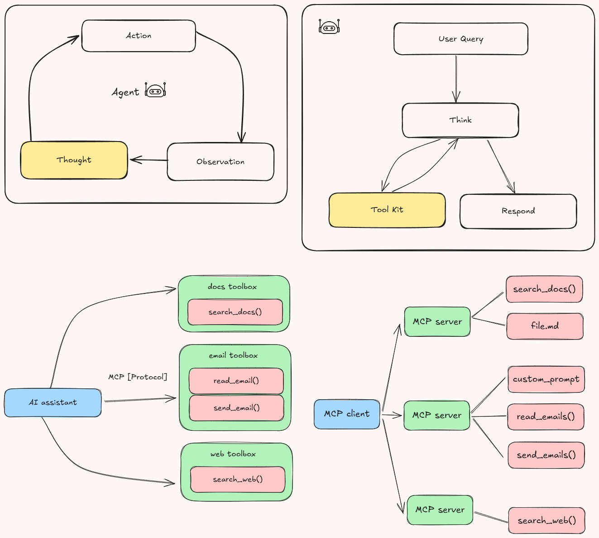

# 🌐 MCP-Server-101

## 🌟 Project Overview
MCP-Server-101 is a robust implementation of the Model Context Protocol (MCP), designed to facilitate seamless integration and interaction with various documentation sources. It provides tools for querying and extracting relevant information from documentation, making it an essential resource for developers working with libraries like `langchain`, `openai`, and `llama-index`.

## 📔 Model Context Protocol (MCP)

The Model Context Protocol (MCP) is an open, standardized protocol that connects AI models with external data sources and tools, functioning like a “USB-C port” for AI applications. MCP uses a client-server architecture: hosts (AI applications) communicate via MCP clients to lightweight MCP servers, which expose specific functionalities by interfacing with local files, databases, APIs, or other services.  

Key components include:  
- **Hosts**: AI applications needing access to external data or tools.  
- **Clients**: Maintain one-to-one connections with MCP servers.  
- **MCP Servers**: Lightweight servers exposing functionality over MCP.  
- **Local Data Sources**: Files or databases accessed by servers.  
- **Remote Services**: External APIs or services accessed by servers.  

MCP servers can provide three main types of capabilities:

- **Resources**: File-like data that can be read by clients (like API responses or file contents)
- **Tools**: Functions that can be called by the LLM (with user approval)
- **Prompts**: Pre-written templates that help users accomplish specific tasks

For example, a host like Cursor instructs its MCP client to update a Google Sheet and send a Slack message; the client then connects to separate MCP servers for Google Sheets and Slack, which call the respective APIs and return the results back through the client to the host.



## 🏗️ Key Functionalities

### 1. Environment Configuration
The project uses `dotenv` to load environment variables, ensuring secure and flexible configuration management.

### 2. Web Search
The `search_web` function performs web searches using the Serper.dev API. It retrieves up to two results for a given query and handles timeouts gracefully.

### 3. Web Content Fetching
The `fetch_url` function fetches and parses visible text content from a webpage. It uses `httpx` for asynchronous HTTP requests and `BeautifulSoup` for HTML parsing.

### 4. Documentation Search Tool
The `get_docs` MCP tool allows users to search documentation for specific queries within supported libraries (`langchain`, `openai`, `llama-index`). It performs a web search constrained to the documentation domain of the selected library and extracts visible text content from the top results.

### 5. Server Execution
The MCP server is executed using the `mcp.run` method with `stdio` transport, making it suitable for integration with other tools and systems.

## 💻 Getting Started

## Prerequisites
- Python 3.12 or higher
- `pip` (Python package manager)
- Access to the Serper.dev API (API key required)

### Installing uv Package Manager

On MacOS/Linux:
```bash
curl -LsSf https://astral.sh/uv/install.sh | sh
```

Make sure to restart your terminal afterwards to ensure that the `uv` command gets picked up.

### Project Setup

1. Create and initialize the project:
```bash
# Create a new directory for our project
uv init mcp-server
cd mcp-server

# Create virtual environment and activate it
uv venv
source .venv/bin/activate  # On Windows use: .venv\Scripts\activate

# Install dependencies
uv add "mcp[cli]" httpx
```

2. Create the server implementation file:
```bash
touch main.py
```

### Running the Server

1. Start the MCP server:
```bash
uv run main.py
```

2. The server will start and be ready to accept connections

## Connecting to Claude Desktop

1. Install Claude Desktop from the official website
2. Configure Claude Desktop to use your MCP server:

Edit `~/Library/Application Support/Claude/claude_desktop_config.json`:
```json
{
    "mcpServers": {
        "mcp-server": {
            "command": "uv",  # It's better to use the absolute path to the uv command
            "args": [
                "--directory",
                "/ABSOLUTE/PATH/TO/YOUR/mcp-server",
                "run",
                "main.py"
            ]
        }
    }
}
```

3. Restart Claude Desktop

## 🧑🏼‍💻 Features and Architecture

### 1. Modular Design
The project is structured to ensure modularity and maintainability. Key components include:
- **`main.py`**: Implements the MCP server with tools for web search and documentation retrieval.
- **`pyproject.toml`**: Defines project metadata and dependencies, ensuring compatibility and ease of setup.
- **`uv.lock`**: Locks dependency versions for consistent environments.

### 2. Asynchronous Operations
The server leverages asynchronous programming for efficient web searches and content fetching, using libraries like `httpx` and `BeautifulSoup`.

### 3. Dependency Management
Dependencies are managed using `pyproject.toml` and locked with `uv.lock`. Key dependencies include:
- `beautifulsoup4`: For HTML parsing.
- `dotenv`: For environment variable management.
- `httpx`: For asynchronous HTTP requests.
- `mcp[cli]`: For MCP server implementation.

### 4. Documentation Search Tool
The `get_docs` tool allows users to query documentation for specific libraries (`langchain`, `openai`, `llama-index`). It integrates web search and content extraction to provide relevant results.

### 5. Extensibility
The project is designed for extensibility, allowing developers to add new tools or integrate additional libraries with minimal effort.

### 6. Environment Configuration
Environment variables are managed using `.env` files, ensuring secure and flexible configuration.

### 7. Standards Compliance
The project adheres to modern Python standards, requiring Python 3.12 or higher, and uses `pyproject.toml` for configuration.

### 8. Dependency Locking
The `uv.lock` file ensures that all dependencies are pinned to specific versions, preventing compatibility issues across environments.

### 9. Future Enhancements
- Add support for additional libraries in the `get_docs` tool.
- Implement caching for frequently accessed documentation.
- Enhance error handling for web requests.

## 🤝 Contributing

Contributions are welcome! Please feel free to submit a Pull Request.

1. Fork the repository
2. Create your feature branch (`git checkout -b feature/AmazingFeature`)
3. Commit your changes (`git commit -m 'Add some AmazingFeature'`)
4. Push to the branch (`git push origin feature/AmazingFeature`)
5. Open a Pull Request

## 📜 License

Distributed under the MIT License. See `LICENSE` file for more information.

## 👋 Connect with Me
Feel free to reach out for collaboration, questions, or potential opportunities! I'm always excited to discuss 
- 🧠 Intelligent AI Agents
- 📊 Risk Analysis & Financial Technology
- 🤖 Machine Learning Solutions
- 🚀 AI-Driven Decision Support Systems

[](https://www.linkedin.com/in/sr099/) [](https://twitter.com/wtfisshivang)